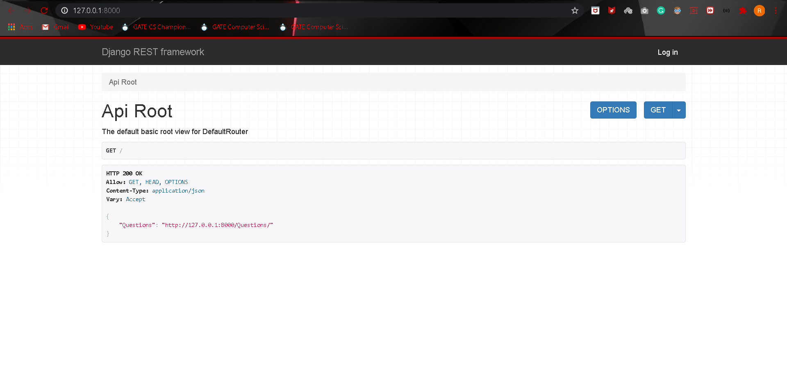
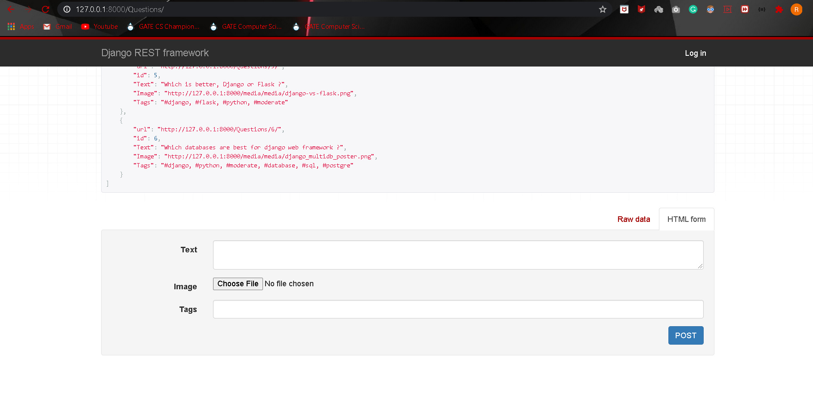
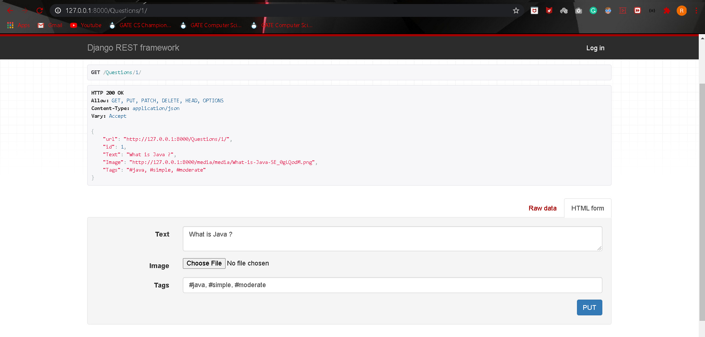
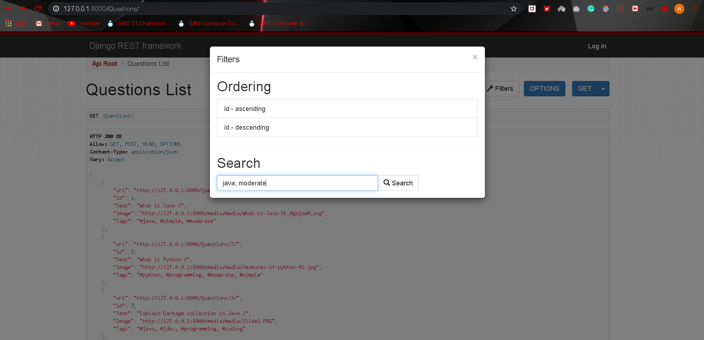
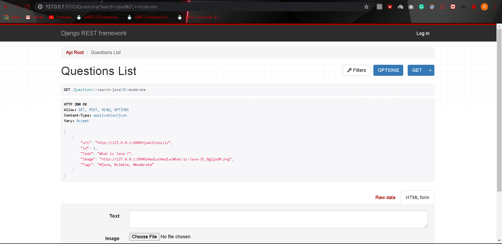
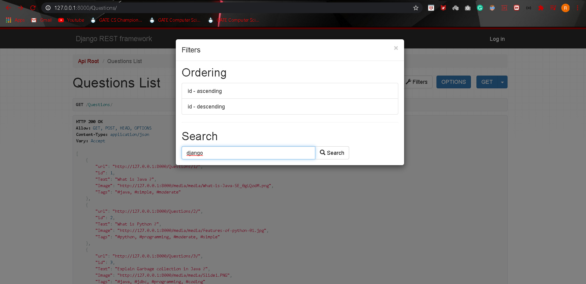
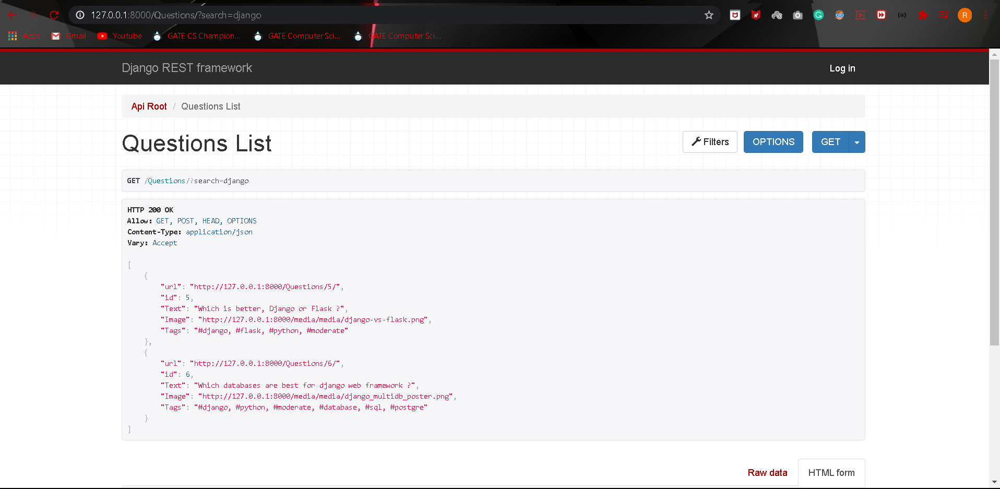
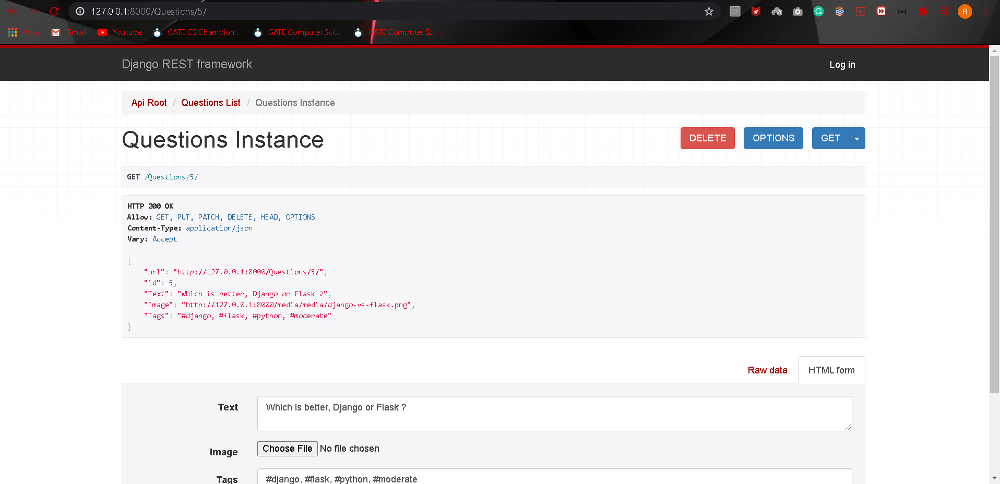

# QnAapi
Structure of a question:
Every question in have these fields → Text (ex: “What is Java?”) 
Image (every question will have an image associated with it) 
Multiple Tags related to the question (ex: “java”, “python”, “simple”, “moderate”)

Example of a sample question: { Text: “Explain Garbage collection in Java”, Image: any sample image file Tags: “moderate”, “java” }

This Api has following functionalities :

API ROOT : Resource routing allows you to quickly declare all of the common routes for a given resourceful controller. Instead of declaring separate routes for your index,
a resourceful route declares them in a single line of code. Enter the API by clicking on the Questions > url 

POST: This API should be able to add a single question to the system. To post a single question, the user will provide the text, image_file and some tags to the POST request.

PUT: Given the question id, this API will update the data related to that particular question. User can update text or image file for a particular question. A user can also add or remove some tags from the question. With every user id, a URL of the profile associated with the particular id is auto generated & gets attached to it so that we can directly go to that profile without editing the browser url again and again.

GET: Given a single tag or a list of tags, this API will return a list of questions which have those tags. Just find Filter option in above right corner & Go to :
(Filters > Search > Enter tags to search).
You can also arrange the api in ascending/descending order of ids.

DELETE : This API can also delete a question posted by a user

• Name of the django-main-project-file > RestQnAapi

• Name of the django-app > app

>> How to get the app running ?

1. Download/Clone the code and open it in any IDE (Microsoft Visual Studio Code) Preffered
2. Download the currently used libraries in this project by running these commands :
                   > pip install django 
                   > pip install djangorestframework
                   > pip install django-filter
                   > pip install django-import-export
                   > pip install Pillow
                  (Ignore & Skip this step if these are already installed in your pc)
3. Save everything
4. Finally run command > python manage.py runserver
5. (Optional) Please do migrations if things doesn't work but as we are using default dbsqlite so it wont be an issue.

If you are facing any issue, Please reach me through mail - mishrarishabh404it@gmail.com
